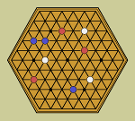
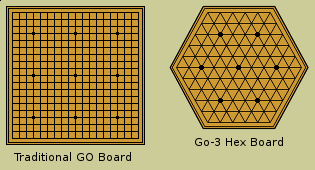

# Go-3
## Hexagonal 3-Player Go Game
 

I've always enjoyed the [game of Go](https://en.wikipedia.org/wiki/Go_%28game%29). I wondered about the possibility of playing a three player version. It was pretty obvious that this would not work on a traditional square board, where any stone would have at most 4 adjacent empty points. I was curious, however, to experiment with a 3-player game on a hexagonal board where each point has 6 neighbors. So I built this application to test the idea.

The app uses a Ruby backend, running on Sinatra, to receive input from the user each time the user makes a move on the board, and returns a response containing moves by the other two players and a list of legal next moves for the user.

At the front end, the application uses a "very thin client" approach. The client script, written with coffeescript, only does three things: draw the board on a canvas element, send the game point clicked to the server if user clicks on a legal move, and receive from the server a new set of legal moves.

This game uses the traditional rules of Go, adapted to the hexagonal grid with 3 players. I haven't yet attempted to implement any AI for the other two players. Their moves are simply picked at random at this point.

Here's an explanation of what to expect while you operate this app, whether you know the rules of Go or not. Traditional Go starts with an empty board, with a square grid of 19x19 lines. Two players, *black* and *white*, alternate placing stones on the gameboard. Button shaped playing pieces called *stones* are played on the intersections of the lines, which are called *points*. In this app, we have a hexagonal shaped board, where each point has six neighbors rather than four. The three players are called *red*, *white* and *blue*. The user plays the red stones, and the moves for white and blue are chosen by the server.

In the course of gameplay in Go, each player forms connected groups of stones, which may or may not be vulnerable to being killed by an opposing player. Since the the white and blue players are just choosing moves randomly in this version of the app, they are incapable of forming invulnerable groups. Therefore, a user who knows how to play Go can eventually kill most of the enemy stones and fill the board with red groups. It should also be noted that in Go, there is no set end to gameplay. The game ends when each side agrees there are no more profitable moves to be made. So perhaps it is best to think of this app as an experiment to play with, rather than an actual game to be played from beginning to end.

### To Play The Game / Run The Application

If you have cloned this repository, run this command:

`ruby go3.rb`

This will start the app at port 4533.

View the app at `localhost:4533`.

The Heroku online deployement of this app has been deactivated. A vercel deployement is currently being put together (Feb 2024).